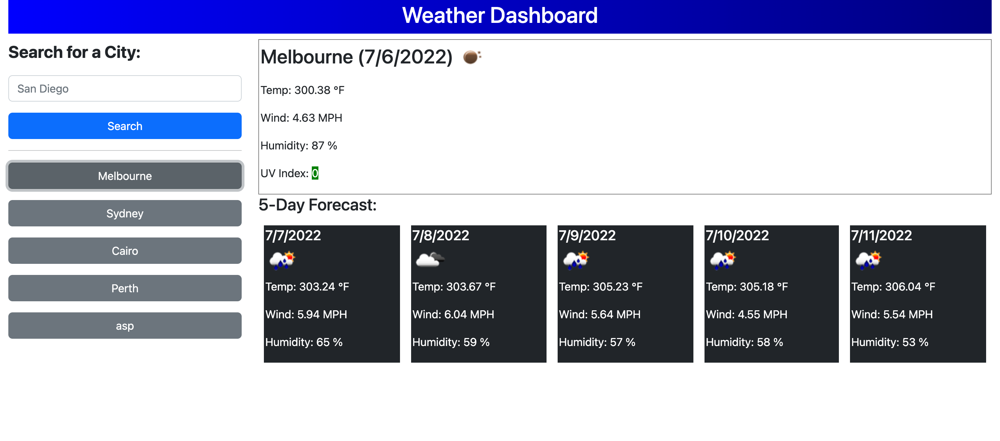
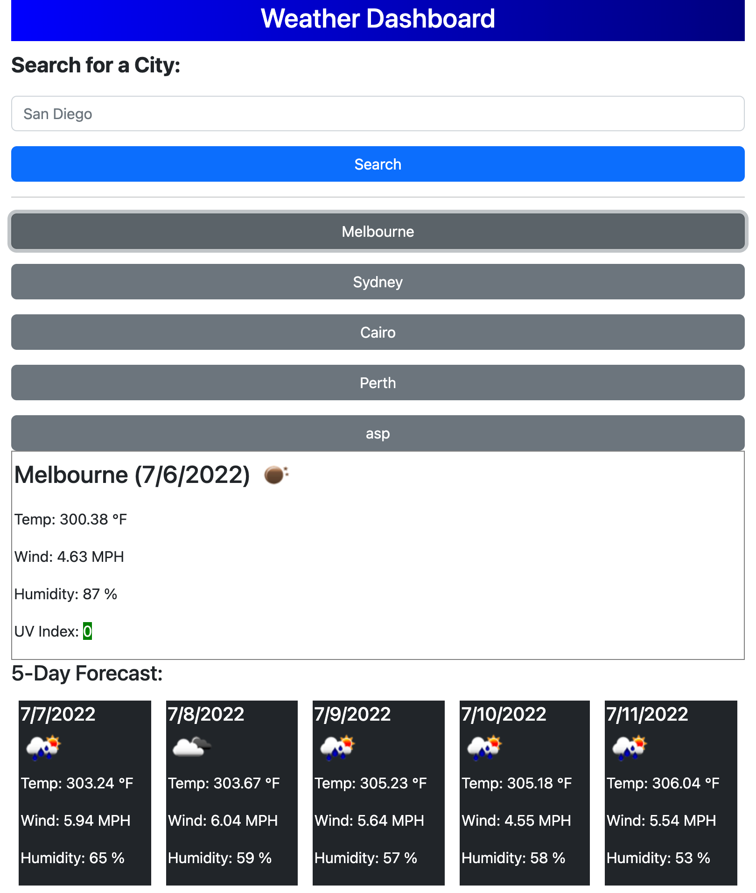

# weather-dashboard

## Description

This is a simply weather dashboard showing the current weather and 5-day weather forecast in one page. It retrieves the data from OpenWeather API. The application is color coded when UV index varies. 

# API Source

Open Weather One Call API
https://openweathermap.org/api/one-call-api

# Run the website

You can open the website by clicking here.
https://dark40.github.io/weather-dashboard/ 

## Screenshots

